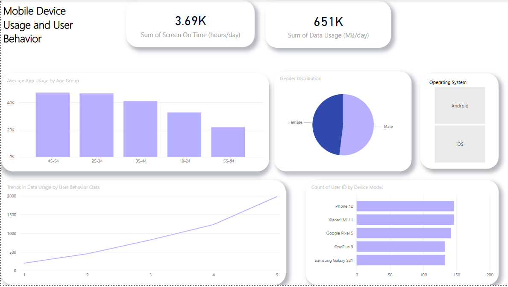

# Mobile Device Usage and User Behavior

## Project Description
This project explores mobile device usage patterns and user behavior across different age groups, operating systems, and user classes. Using Power BI, the dataset is visualized to uncover key insights into app usage, screen-on time, battery drain, and data consumption.

### Dataset Overview
The dataset contains 700 samples of user data with the following key features:
- **User ID**: Unique identifier for each user.
- **Device Model**: Smartphone model used.
- **Operating System**: iOS or Android.
- **App Usage Time**: Daily time spent on apps (in minutes).
- **Screen On Time**: Daily active screen time (in hours).
- **Battery Drain**: Daily battery consumption (in mAh).
- **Number of Apps Installed**: Count of installed apps.
- **Data Usage**: Daily data usage (in MB).
- **Age**: User's age.
- **Gender**: Male or Female.
- **User Behavior Class**: Categorized user behavior (1 to 5).

### Key Insights and Visualizations
1. **Average App Usage by Age Group**:
   - Users aged **25-34** show the highest app usage time.
   
2. **Comparison of iOS vs. Android**:
   - iOS users have higher average **screen-on time** and **data usage**.
   - Android users experience more **battery drain**.

3. **Trends in Data Usage by User Behavior Class**:
   - Higher user behavior classes are associated with significantly increased data consumption.

4. **Gender Distribution**:
   - The dataset features a fairly balanced distribution between male and female users.

### Screenshots
Below is a snapshot of the Power BI dashboard created for this project:

### Tools Used
- **Power BI**: For data visualization and interactive dashboards.

